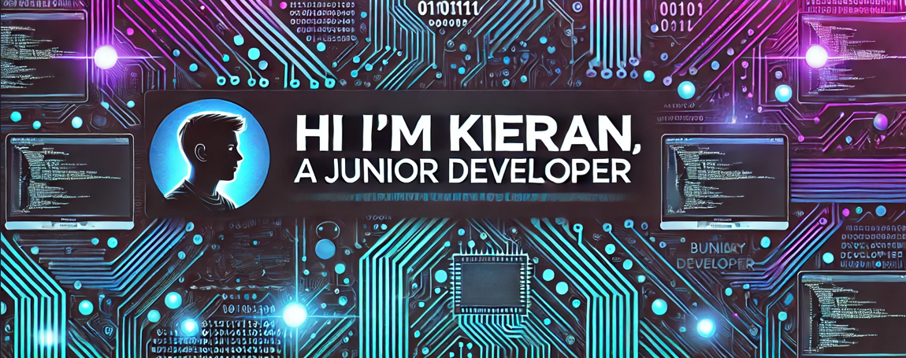

<h1>Hi there! 👋</h1>

I'm a self-taught software developer, passionate about turning my love for coding into a fulfilling career. At 28, I've embraced the journey of learning software development, always eager to expand my skill set and build impactful solutions.

<h2>About Me</h2>

- 🌍 **Location:** Coventry, United Kingdom
- 🎓 **Education:** Driven self-learner with a constant thirst for knowledge
- 💻 **Current Focus:** Delving deep into software development and building real-world projects

<h2>My Journey</h2>

I first discovered coding in 2009 at the age of 13 through game modding, dabbling in C# and Python. However, after losing a parent at 14, I took a break from coding and returned to it in 2023 at 27. I reignited my passion, starting with HTML, CSS, and JavaScript, and am now exploring C#, backend development, and more.

<h2>💻 Tech Stack:</h2>

  
  
  
  
  
  
  
  
  
  
  
  

<h4>🌐 Socials:</h4>

<h3>📊 GitHub Stats</h3> :

 
 

<h3>🏆 GitHub Trophies</h3>

<h3>✍️ Random Quote</h3>

